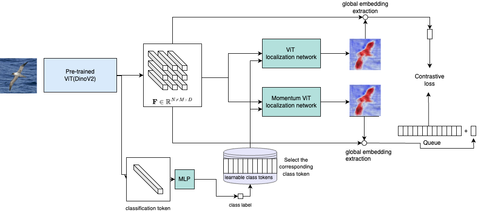

# 📄 Weakly-supervised Object Localization using Vision Transformer and Visual Foundation Models:  

## 📌 Abstract  
Weakly-supervised object localization is the task of identifying the objects in images with bounding boxes when only image class labels are available during the training.  In this work, we leverage the dense features extracted from pre-trained Visual Foundation Models (VFMs) and train a transformer network to predict foreground probability distributions. The feature of the proposed method is to disentangle the classification path from the segmentation path through the frozen and pretrained features in VFMs, preventing the map from focusing on discriminative parts of the image. We use momentum contrastive learning (MoCo) to classify the patch tokens as foreground and background in a self-supervised manner. The contrastive loss is designed to increase the distance between the a global representation of foreground and background features of the image. The experiments show state-of-the-art performance of our method in terms of localization accuracy compared to other methods including the ones that use image labels.

## 🌟 Highlights  
- ✅  State-of-the-art method for weakly supervised object localization based on ViTs
- ✅  The method is completely based on visual features and unlike other methods does not require heuristic text prompts
- ✅  Training is done on a quite lightweight network, resulting in a fast training

## 🖼️ Method Overview  
  
*patch tockens extracted from the base network (pretrained and frozen) are classified by a localization network trained with the momentum contrast \cite{moco}. The localization network additionally recieves a class-specific feature which encode information related to the specific class and is selected based on the predicted class from the Base ViT classification token. The localization network produces a heatmap indicating the probability of the feature belonging to the foreground. Embedding extractor outputs a vector embedding based on the features and the heatmap. The vector embeddings are stored in the queue and are used in the contrastive loss.*  

